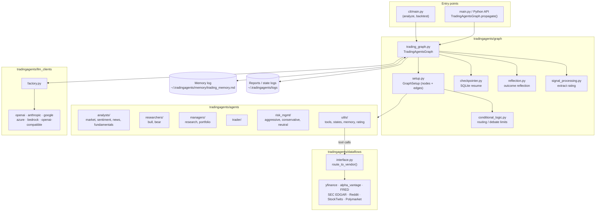
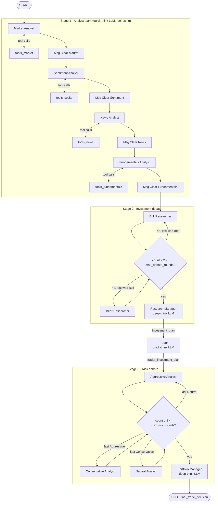
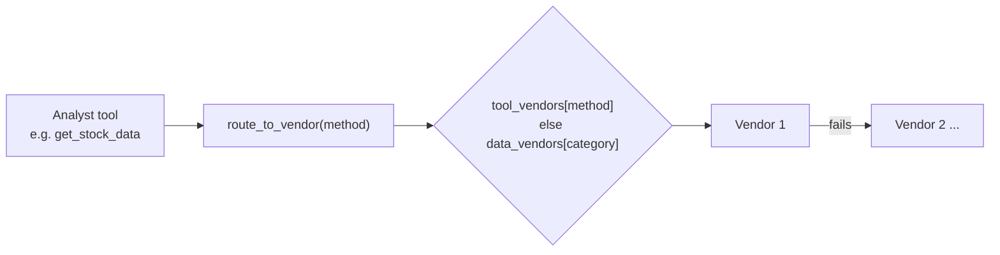
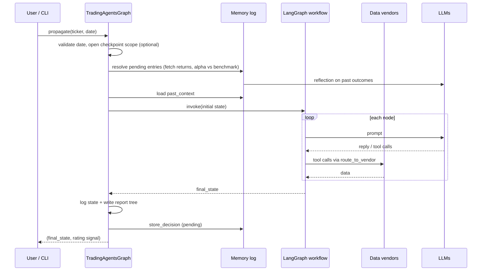

# TradingAgents Architecture & Workflow

TradingAgents is a multi-agent LLM framework that mimics a trading firm. Specialised agents analyse a ticker, debate a thesis, propose a trade, stress-test it for risk, and emit a final 5-tier rating. The orchestration is a [LangGraph](https://langchain-ai.github.io/langgraph/) `StateGraph`.

## 1. High-level layers



## 2. Agent workflow (the LangGraph)

Defined in [tradingagents/graph/setup.py](tradingagents/graph/setup.py). Analysts run **sequentially**, each looping with its tool node until it stops calling tools, then its messages are cleared before the next analyst starts.



### Stage by stage

| Stage | Nodes | Reads | Writes (state key) |
|---|---|---|---|
| 1. Analysts | Market, Sentiment, News, Fundamentals | ticker, date, `instrument_context`, `past_context` | `market_report`, `sentiment_report`, `news_report`, `fundamentals_report` |
| 2. Investment debate | Bull ↔ Bear, then Research Manager | the four reports, debate history | `investment_debate_state`, `investment_plan` |
| 3. Trading | Trader | `investment_plan` | `trader_investment_plan` |
| 4. Risk debate | Aggressive → Conservative → Neutral (loop), then Portfolio Manager | trader plan, reports, `portfolio_context` | `risk_debate_state`, `final_trade_decision` |

Notes:
- Analysts are selectable (`selected_analysts`); the first selected one is wired to `START`, the last to Bull Researcher.
- Debate length is bounded by `max_debate_rounds` and `max_risk_discuss_rounds` (default 1 each); overall graph recursion by `max_recur_limit` (100).
- Deep-think LLM: Research Manager and Portfolio Manager. Quick-think LLM: everything else.
- Research Manager, Trader, and Portfolio Manager use structured output (`ResearchPlan`, `TraderProposal`, `PortfolioDecision` in [schemas.py](tradingagents/agents/schemas.py)) and fall back to free text if the provider lacks it.
- Final rating scale: Buy / Overweight / Hold / Underweight / Sell, or `REVIEW` when no rating can be parsed.

## 3. Shared state

`AgentState` ([agent_states.py](tradingagents/agents/utils/agent_states.py)) extends LangGraph's `MessagesState`:

```
messages                      (per-analyst scratch, cleared between analysts)
company_of_interest, asset_type, instrument_context, trade_date
market_report / sentiment_report / news_report / fundamentals_report
investment_debate_state       {bull_history, bear_history, history, current_response, judge_decision, count}
investment_plan
trader_investment_plan
risk_debate_state             {aggressive/conservative/neutral_history, latest_speaker, judge_decision, count, ...}
final_trade_decision
past_context                  (memory log injected at start)
portfolio_context             (optional holdings/cash supplied by caller)
```

## 4. Data layer

Analyst tools (in `agents/utils/*_tools.py`) all call `route_to_vendor()` in [dataflows/interface.py](tradingagents/dataflows/interface.py), which resolves the vendor chain from config.



| Analyst | Tools |
|---|---|
| Market | `get_stock_data`, `get_indicators`, `get_verified_market_snapshot` |
| Sentiment | `get_news` (plus StockTwits / Reddit sources) |
| News | `get_news`, `get_global_news`, `get_insider_transactions`, `get_macro_indicators`, `get_prediction_markets` |
| Fundamentals | `get_fundamentals`, `get_balance_sheet`, `get_cashflow`, `get_income_statement` |

Categories (`data_vendors` in [default_config.py](tradingagents/default_config.py)): `core_stock_apis`, `technical_indicators`, `fundamental_data`, `news_data` (yfinance / alpha_vantage), `macro_data` (FRED), `prediction_markets` (Polymarket). Only the configured vendors are used; fallback happens only if you list several, e.g. `"yfinance,alpha_vantage"`.

## 5. Run lifecycle



Key points:
- **Memory / reflection loop.** Each decision is appended as *pending* to a markdown log. On the next run for that ticker (or via `settle_pending`), once `holding_period_days` (default 5) have traded, the raw and benchmark-relative return are computed (benchmark chosen by ticker suffix via `benchmark_map`), an LLM writes a reflection, and the entry is resolved. Same-ticker history and cross-ticker lessons are injected as `past_context` in later runs.
- **Checkpointing.** With `checkpoint_enabled`, LangGraph persists state per node in SQLite keyed by ticker + date + graph shape; a crashed run resumes, and the checkpoint is cleared on success.
- **Portfolio context.** An optional `PortfolioContext` (positions, cash) is rendered into `portfolio_context` for the Portfolio Manager.

## 6. Backtesting

`tradingagents backtest` ([backtest.py](tradingagents/backtest.py)) iterates a date grid (`iter_grid`), runs `propagate` + `record_decision` for each date, calls `settle_pending`, then `summarize()` computes per-rating returns and alpha from the memory log.

## 7. LLM clients

`create_llm_client(provider, model, base_url, **kwargs)` in [llm_clients/factory.py](tradingagents/llm_clients/factory.py) lazily imports the provider module. Providers: OpenAI (and OpenAI-compatible endpoints), Anthropic, Google, Azure, Bedrock. Common knobs: `temperature`, `llm_max_retries`, `max_tokens`, plus provider-specific reasoning settings (`openai_reasoning_effort`, `anthropic_effort`, `google_thinking_level`).

## 8. Configuration

Defaults live in [default_config.py](tradingagents/default_config.py); any `TRADINGAGENTS_*` env var listed in `_ENV_OVERRIDES` overrides it (types coerced from the default). API keys go in `.env` (see `.env.example`).

| Group | Keys |
|---|---|
| Models | `llm_provider`, `deep_think_llm`, `quick_think_llm`, `backend_url` |
| Debate | `max_debate_rounds`, `max_risk_discuss_rounds`, `max_recur_limit` |
| Data | `data_vendors`, `tool_vendors`, `news_article_limit`, `global_news_*` |
| Memory | `memory_log_path`, `memory_log_max_entries`, `holding_period_days`, `benchmark_ticker` |
| Ops | `checkpoint_enabled`, `output_language`, `results_dir`, `data_cache_dir` |

## 9. Repository map

```
cli/                        Typer CLI (analyze, backtest), prefs, stats
main.py                     Minimal programmatic example
tradingagents/
  graph/                    Orchestration: graph build, routing, checkpoint, reflection
  agents/                   Analysts, researchers, managers, trader, risk debators, schemas, tools
  dataflows/                Vendor adapters + routing (yfinance, Alpha Vantage, FRED, EDGAR, ...)
  llm_clients/              Provider clients + model catalog/validators
  backtest.py  portfolio.py  reporting.py
```
